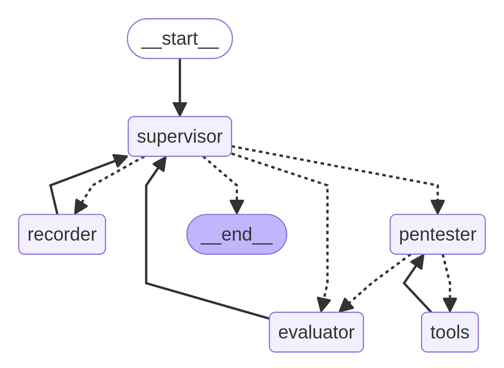

# BreachSeek

A multi-agent AI model designed to automate penetration testing

## Model Architecture
The model utilizes LangGraph and implements the following architecture/workflow:



## Installation

We recommend creating a virtual environment using 

```console
python -m venv venv
```

Activate the venv:
```console
source venv/bin/activate
```

Then install the required libraries, make sure to install that chat model you prefer, you can uncomment lines inside the requirements file or add your own. 

```console
pip install -r requirements.txt
```

## Running the code 
First ensure that in the an OS environment of `ANTHROPIC_API_KEY` has already been set

Run the following for the backend
```console
python main.py
```

Change directories into the UI folder
```console
cd ui
```

Run the following:
```console
npm install
```

```console
npm run dev
```

You can access the web UI at `localhost:3000`
