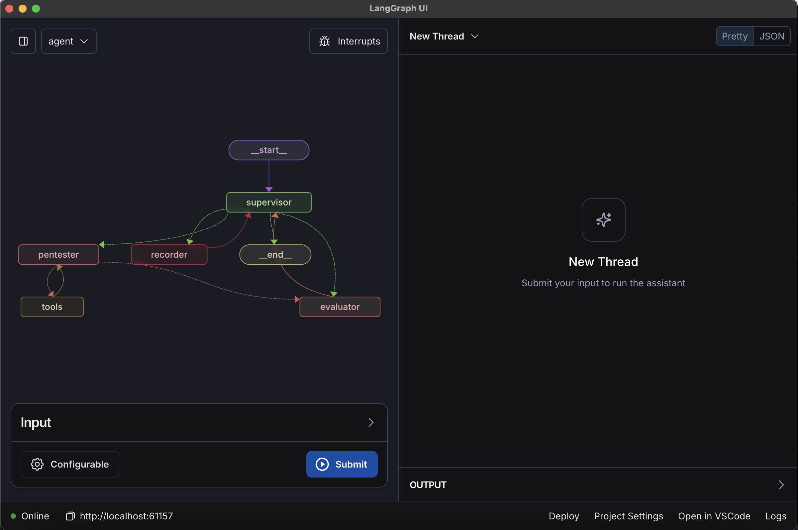

# LangGraph Cloud Example

> [!TODO]
> Add logic to nodes and routes
Check out [LangGraph Example](https://github.com/langchain-ai/langgraph-example) and [LangGraph Engineer](https://github.com/hwchase17/langgraph-engineer) for how to structure the code.

